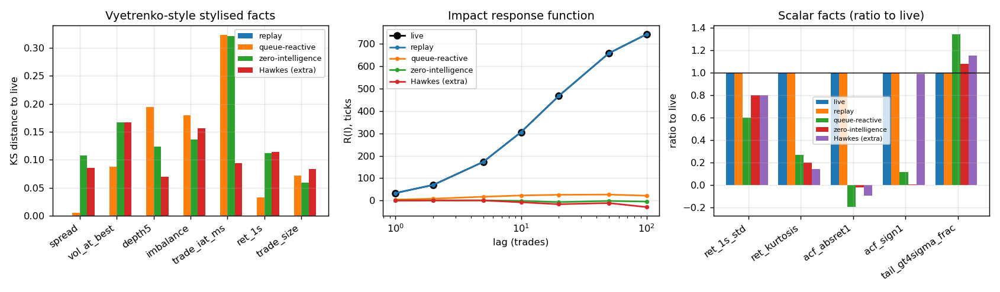
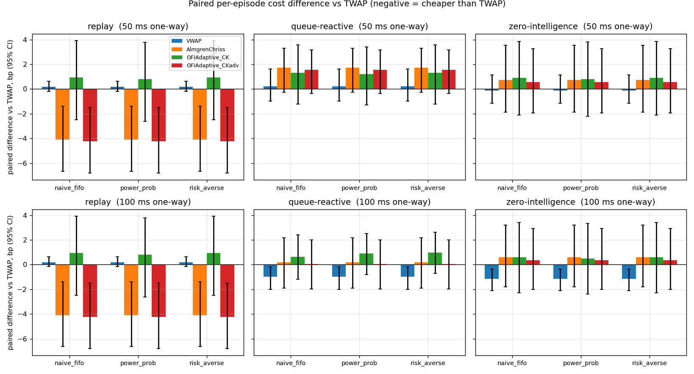
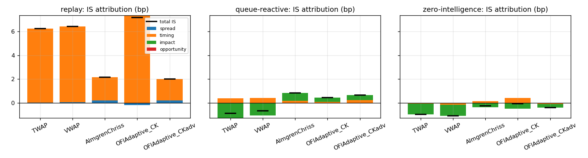
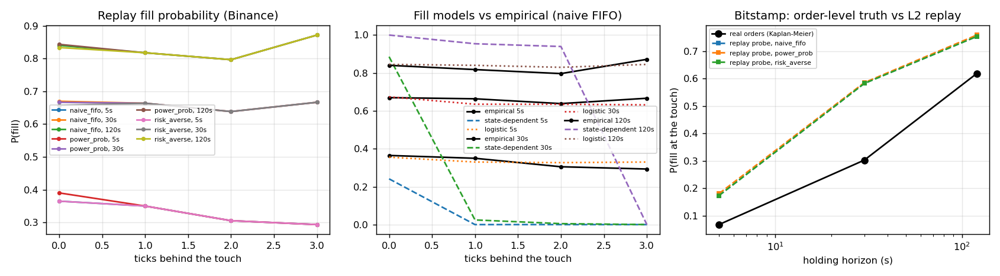
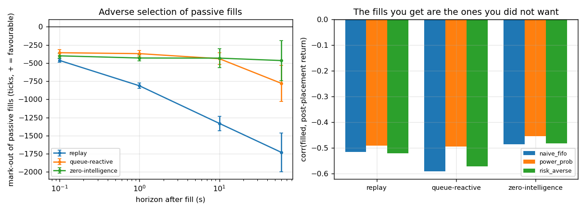
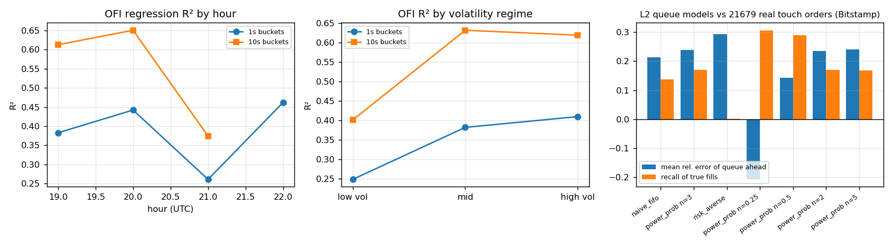

# lob-execution-sim — order-book execution simulator and TCA

**Question.** How much does the choice of order-book simulator change the *ranking* of execution algorithms, and how much implementation shortfall can an order-flow-aware scheduler save once queue position and fills are modelled honestly?

**Answer on the recorded data (one Binance BTCUSDT day, 2.8 h; §Results).** The ranking of TWAP / VWAP / Almgren–Chriss / OFI-adaptive is different in every simulator mode: replay, queue-reactive and the zero-intelligence null give three different orderings at 50 ms latency and three different ones again at 100 ms. In replay — which has no impact by construction — the front-loaded schedules (Almgren–Chriss, and the mark-out-aware OFI scheduler, which learns to post nothing) beat TWAP by ~4 bp with paired CIs excluding zero, a timing effect of this one day; in the queue-reactive mode the same front-loading costs +1.7 bp of impact and TWAP is first. The naive Cont–Kukanov scheduler, which values spread capture at face value and posts 94 % of the parent passively, is the *worst* algorithm in replay (+0.9 bp vs TWAP). What is robust across modes is the adverse selection of passive fills: a limit order at the touch that gets filled is marked out 300–500 ticks against you within 100 ms in every mode and −1,700 ticks (−2.3 bp) after 60 s in replay, and being filled is negatively correlated with the subsequent return (ρ ≈ −0.5). Checked against 21,687 real Bitstamp touch orders, every L2 queue-position model overestimates the queue ahead by ~20 %, while the replay's "a trade through your price fills you" rule roughly doubles the short-horizon fill probability relative to a Kaplan–Meier estimate on the real orders.

Literature cut-off November 2024; every method cited existed by then. Crypto is a proxy: 24/7, maker/taker fees, no last look, no internalisation — the methods are the ones published on equities and FX.

---

## Layout

| path | what |
|---|---|
| `tools/recorder/recorder.py` | raw websocket recorder: Binance `depth@100ms`+`trade` synchronised to a REST snapshot (U/u rule), Coinbase `level2_batch`+`matches`, Bitstamp `live_orders`/`live_trades` (order-by-order). Append-only hourly NDJSON; `raw_to_parquet.py` archives it |
| `include/lobsim/*.hpp` | C++20 engine (header-only): book, tape, queue models, simulators, calibration, algos, fill models, validation, analysis, L3 check, FIX 4.4 |
| `src/main.cpp` → `lobsim` | CLI: `rebuild`, `calibrate`, `synth`, `validate`, `fillcurve`, `ofi`, `markout`, `bench`, `l3check` |
| `src/fix_gateway.cpp` → `fixgw` | FIX 4.4 gateway around any simulator mode, and the identical-fills self-test |
| `tests/known_answer_tests.cpp` | 52 hand-checkable assertions (flat-book TWAP, book walking, replay = history, queue models, latency, determinism, attribution identity, OFI, FIX round trip) |
| `storage/kdb/*.q`, `storage/duckdb/` | kdb+ tick store (schema, loader, `aj` / VWAP / OFI / mark-out queries) and Parquet + DuckDB research layer |
| `scripts/run_all.sh` | the whole pipeline, raw → figures; `plots.py`, `summarize.py`, `report.py` |
| `results/` | JSON/MD outputs, figures, `summary.md`; `report.pdf` at the root; `notebooks/results.ipynb` |
| `configs/calib_binance_BTCUSDT.json` | the calibrated market model (used by CI to run the synthetic pipeline without data) |

Build: `./build.ps1` (MSVC + Ninja) or `cmake -S . -B build -G Ninja && cmake --build build`. Python 3 with `websockets aiohttp pyarrow duckdb numpy pandas matplotlib fpdf2` for the recorder, storage and figures.

---

## Data capture

Recorded on 2026-09-15 with `recorder.py`; everything is logged raw before it is parsed, and the book is rebuilt offline (`lobsim rebuild`), deterministically.

| venue | feed | duration | messages | sequence gaps | resyncs | snapshot parity | recv − exchange time p50 / p95 |
|---|---|---|---|---|---|---|---|
| Binance spot BTCUSDT | `depth@100ms` + `trade` (L2) | 2.8 h | 448k | 2 (both at recorder restarts) | 3 | 63,248 price levels compared against Binance's own snapshots at their `lastUpdateId`, **0 mismatched** | 169 / 182 ms |
| Coinbase Exchange BTC-USD | `level2_batch` + `matches` (L2) | 2.8 h | 263k | 0 | 3 | absolute levels, no sequence chain | 105 / 140 ms |
| Bitstamp BTC/USD | `live_orders` + `live_trades` (L3, order ids) | 1.3 h | 471k orders, 2.7k trades; 21,687 touch orders tracked | – | 1 | L3-derived top of book agrees with the exchange's `diff_order_book` 91 % of the time (timing skew) | 89 ms |

Operational notes the recorder had to get right: the Binance snapshot is `weight 250`, so it is fetched once per resync, never in a loop; a Bitstamp snapshot must be fetched only after the stream is live (otherwise deletions fall into a hole and the rebuilt book stays crossed); Bitstamp order and trade microtimestamps are not mutually causal, so the tape uses receive order with a monotone clock; two recorder instances writing one file interleave chunks, so the rebuilders sort by receive time and de-duplicate by id. Coinbase's `full` channel needs an API key since 2023 (the recorder supports it via `COINBASE_KEY/SECRET/PASSPHRASE`); Bitstamp's public order-level feed plays the role the plan gave to Coinbase `full`. The receive-minus-exchange offset is network latency plus clock offset and is reported, not corrected.

---

## Method

**Engine.** Integer ticks/lots, event-driven, one order-entry interface (`Simulator`) for all modes: new / cancel / replace (loses priority) / partial fills, one-way order latency and report latency, maker/taker fees as a separate column. Algorithms only see this interface, which is why the same code runs through the FIX gateway.

**Mode (a) replay + queue position.** History is fixed; our order joins the back of the visible queue and advances on trades at its price and on cancellations according to one of three rules (hftbacktest's `queue.rs`, reproduced exactly):

```
trade(q):            front -= q
depth(prev → now):   chg = prev − now − trades_since_last_depth
    increase:        front = min(front, now)
    decrease:        p = f(back) / (f(back) + f(front)),   f(x) = x^n
                     front = min( front − (1−p)·chg + min(back − p·chg, 0),  now )
fill:                when front < 0, |front| lots execute
```
naive FIFO is `n = 1` (cancels uniform along the queue), the power-probability model uses `n = 3`, the risk-averse model sets `front = min(front, now)` on every decrease (all cancels behind us). A public trade through our price fills us. Our taker orders walk the displayed book and do not remove liquidity: replay has no impact by construction.

**Mode (b) queue-reactive.** Huang–Lehalle–Rosenbaum (2015): reference price `p_ref` on the half-tick grid, `K = 10` levels a side, intensities `λ^L_i(q), λ^C_i(q), λ^M(q)` per level and queue-size bucket (half-octaves of `q / AES`), estimated as event counts over time-in-state from the decomposed L2 diffs (increase = limit arrival, decrease = market order up to the traded volume then cancellation). Order sizes are non-unit, drawn from empirical size laws conditional on (type, level, bucket) — the Bodor–Carlier extension. Our resting orders are part of the visible queue, and our market orders eat it, so the book reacts to us. One extension, stated as such: BTCUSDT on a $0.01 tick is a small-tick book whose quotes reposition by ~370 ticks about 0.7×/s; no tick-by-tick queue mechanism can generate that, so the book is re-initialised around a new reference price (HLR's re-initialisation, θ = 1) at jump times drawn from a rate and direction law estimated *conditional on the touch imbalance*: `λ_J(I)`, `P(up | I)` with `I = (Q_bid − Q_ask)/(Q_bid + Q_ask)`. On the recorded day `λ_J` is 0.55/s at the extreme-imbalance buckets vs 0.10/s at balance, and `P(up)` runs from 0.02 to 0.98 across the buckets, so our own resting size moves the jump law — a second impact channel.

**Null model.** Abergel–Jedidi (2013) zero-intelligence Poisson book: the same book mechanics with constant `λ^L_i`, cancellations `c_i · q_i`, constant `λ^M`, unconditional jumps. Anything the queue-reactive mode gets right and this gets wrong is due to state dependence. A 6-type Hawkes mode (sum-of-exponentials kernels, EM-fitted, Bacry–Mastromatteo–Muzy 2015) is included as an extra and reported in the realism table only.

**Realism (Vyetrenko et al. 2020).** Distributions of spread, volume at best, depth, imbalance, inter-arrival times, return kurtosis and autocorrelation, volatility clustering, tails, and the impact response function `R(ℓ) = E[ε_n (m_{n+ℓ} − m_n)]` (Bouchaud et al. 2018), each computed identically on the live tape and on every simulator's tape, with KS and Wasserstein-1 distances.

**Signals and fills.** OFI (Cont–Kukanov–Stoikov 2014) `e_n = 1{P^b_n ≥ P^b_{n−1}} q^b_n − 1{P^b_n ≤ P^b_{n−1}} q^b_{n−1} − 1{P^a_n ≤ P^a_{n−1}} q^a_n + 1{P^a_n ≥ P^a_{n−1}} q^a_{n−1}`, regressed on the mid change per 1 s / 10 s bucket, R² by hour and volatility tercile. Fill probability as a function of distance and queue position from thousands of replay probes under each queue model (probes are independent in replay), and two fill models: a state-dependent first-passage model in the spirit of Lokin–Yu (2024) — the queue at our level evolves under the calibrated `λ^{L,C,M}(q)` and the chosen cancellation rule until our position clears (Monte Carlo, cached) — and a logistic surrogate fitted on the probes. Adverse selection: mark-outs at 100 ms / 1 s / 10 s / 60 s of every simulated passive fill, and corr(filled, post-placement return).

**Schedulers.** All slice schedulers with a target curve and a child-order policy. TWAP; VWAP on the recorded 5-minute volume profile; Almgren–Chriss (2001) `x(t) = X sinh(κ(T−t))/sinh(κT)`, `κ = sqrt(λσ²/η)` with σ and η from the data (η = mid response to signed flow); and the OFI-adaptive scheduler: AC curve, slice sizes tilted by the OFI forecast `β·OFI/σ`, each slice split into market and limit quantities by the single-venue Cont–Kukanov (2017) rule

`min_{M,L}  h·M − (h − a)·L·p(L) + λ_u · E[shortfall]`

with `h` the half spread, `p(L)` the fill probability from the fill model, `a` the adverse mark-out charged to a passive fill (0 in `OFIAdaptive_CK`, the measured 10 s mark-out in `OFIAdaptive_CKadv`), `λ_u` the penalty per unfilled lot; unfilled limits are cancelled at the slice end and the remainder swept at the horizon.

**Shortfall attribution** (per lot, cost positive, sums to IS by construction):

```
spread      = Σ q_i s (px_i − m1(t_i))          m1: mid just before the fill in this run
impact      = Σ q_i s (m1(t_i) − m0(t_i))       m0: counterfactual mid path, same seed, no orders
timing      = Σ q_i s (m0(t_i) − m0(t_arrival))
opportunity = unfilled · s · (far touch − m_arrival)
```
In replay `m0 ≡ m1` so impact is identically zero; in the generative modes the counterfactual is the same random-number stream without our orders, so "impact" includes the divergence noise after our first action.

**FIX 4.4.** A self-contained session layer (Logon/Heartbeat/TestRequest/Logout, sequence numbers, checksums) with NewOrderSingle, OrderCancelRequest, OrderCancelReplaceRequest, ExecutionReport and MarketDataSnapshotFullRefresh; standard wire format, so a QuickFIX initiator can connect. The gateway runs in lockstep with the simulator (one `W` per event, acknowledged by the client), so the algorithm sees the same event/fill sequence as in-process; `fixgw --selftest` asserts identical fill lists for all five algorithms.

---

## Results

### Simulator realism


Both generative modes reproduce spread, volume at best, imbalance and the 1 s return distribution (KS ≤ 0.2); neither reproduces the trade inter-arrival law (real Binance market orders arrive in bursts; only the Hawkes extra gets it, KS 0.09) and both under-generate volatility (333 and 443 ticks/s vs 555 live) and kurtosis. The impact response separates them: live `R(ℓ)` rises from 34 to 743 ticks over 100 trades; the queue-reactive mode has the right sign and shape (5 → 22) through the imbalance-conditioned jumps; the zero-intelligence null and the Hawkes extra are flat or negative (1 → −5, 0 → −29). A simulator that gets the stylised facts right and the response function wrong is useless for execution; on that criterion only the queue-reactive mode is usable, and it is 30× too small.

### Cost ranking


Parent order 3 BTC (300,000 lots) over 300 s in 10 slices, 12 episodes alternating buy/sell, 50 ms one-way latency, and the same table at 100 ms; the OFI scheduler uses the logistic fill model fitted on the replay probes and, in its `CKadv` variant, charges passive fills the measured 10 s mark-out (1,332 ticks). Three distinct rankings across the three modes at each latency (`results/bench.json` → `ranking_instability`):

| | replay | queue-reactive | zero-intelligence |
|---|---|---|---|
| 50 ms | CKadv < AC < TWAP < VWAP < CK | TWAP < VWAP < CK < CKadv < AC | VWAP < TWAP < CKadv < AC < CK |
| 100 ms | CKadv < AC < TWAP < VWAP < CK | VWAP < TWAP < CKadv < AC < CK | VWAP < TWAP < CKadv < CK < AC (power-prob) |

Replay, naive FIFO, 50 ms: AC −4.10 bp vs TWAP [−6.64, −1.38]; CKadv −4.24 [−6.80, −1.50]; CK +0.93 [−2.47, +3.93]; VWAP +0.19. Queue-reactive: AC +1.72 [−0.26, +3.31] (impact +0.65 bp), CK +1.32, CKadv +1.56. The absolute level is timing noise (σ ≈ 1 bp/√s on a 5-minute horizon), which is why the table reports paired differences. The queue assumption barely moves the numbers on this venue because fills come from quote jumps, not from the queue draining. Full table: `results/bench.md`; four synthetic queue-reactive days with day-paired CIs (2 and 3 distinct rankings): `results/bench_synth_days.md`.



### Fills and queue position


On Binance a probe at the touch fills with probability 0.36 / 0.67 / 0.84 within 5 / 30 / 120 s (0.73 / 0.62 / 0.53 by low / mid / high queue-ahead tercile), and the curve is flat in distance behind the touch: fills come from the quote jumping through the order, not from the queue draining, which is also why the three queue assumptions differ by only a few points. Consequently the queue-draining (Lokin–Yu-style) fill model is right only at the touch and wrong behind it (it predicts 0 at 2–3 ticks), the Poisson fallback is too optimistic, and the logistic surrogate fitted on the probes is the one the scheduler uses. Against 21,687 real Bitstamp touch orders, every L2 queue model *overestimates* the queue ahead (mean relative error +0.21 naive, +0.24 power n = 3, +0.29 risk-averse; a front-loaded exponent n = 0.5 halves the bias to +0.14 but doubles the false fills), and the L2 models mark only ≤ 17 % of the orders that really filled as filled. The replay probes on the same tape fill 0.17 / 0.58 / 0.75 at 5 / 30 / 120 s against a Kaplan–Meier 0.07 / 0.30 / 0.62 for the real orders, with cancellation as censoring — an upper bound on the replay's optimism, since owners cancel *because* the price moved.

### Adverse selection


Passive fills at the touch are marked out −460 ticks after 100 ms and −1,300 to −1,700 ticks after 10–60 s in replay (−1.8 to −2.3 bp), less in the queue-reactive mode (−360 → −780) and least in the null (−400 → −470). corr(filled, return) is −0.51 in replay, −0.59 queue-reactive, −0.49 zero-intelligence: the fills you get are the ones you did not want, in every simulator, and the replay is the harshest at every horizon beyond 100 ms. Measured queue-position value (Moallemi–Yuan 2016): `P(fill) × (half spread + 60 s mark-out)` is negative in every tercile of queue position in every mode — on a $0.01-tick book the half spread is 0.5 tick against hundreds of ticks of adverse selection — which is why the mark-out-aware scheduler variant posts nothing and the naive one, which posts 94 %, loses.

### OFI


OFI explains 36 % of 1-second and 57 % of 10-second mid changes (β = 5.9e-4 / 6.9e-4 ticks per lot), more in high-volatility regimes (R² 0.25 → 0.41 across terciles at 1 s). Leakage audit: OFI uses only past quotes, the forecast is applied to the next slice, and the OFI slope is estimated on the same day it is traded (stated in-sample; there is one day).

---

## Validation

- **Known-answer tests** (`build/known_answer_tests`, 52 checks): flat-book TWAP = exactly the half spread with zero timing/impact/opportunity; a 120-lot market order into 100@1000 + 50@1001 averages (100·1000 + 20·1001)/120; replay without our orders reproduces the tape event by event; tape write/read is exact; queue-model updates match the hftbacktest rules on worked examples; latency respected; same seed → same generative path; attribution sums to IS; OFI formula on a worked example; FIX encode/decode and checksum rejection.
- **Realism metrics per mode** and the impact response function: table above and `results/validation.json`.
- **Shortfall attribution sums by construction** (asserted in the tests, reported per cell in `bench.md`).
- **Fill-model sensitivity**: `fillcurve.json` compares empirical, state-dependent, logistic and Poisson fill probabilities per distance and horizon and per queue model; the scheduler can be run with any of them (`--fill-model`).
- **Cost ranking with confidence intervals**: paired per-episode (one day) bootstrap; day-paired on the synthetic days; **no pooling across days**.
- **Latency doubled**: the whole table is re-run at 100 ms; the rankings change again.
- **Order-level check** of the queue-position models against Bitstamp fills (`l3check.json`).
- **FIX self-test**: identical fills in-process and through FIX 4.4 for all algorithms.

**CV bullet as supported by the data.** Execution backtester with replay, queue-reactive and zero-intelligence simulators validated on order-book stylised facts and impact response; queue-position model checked against 21,687 order-level Bitstamp fills; OFI-adaptive Cont–Kukanov scheduler on 2.8 h of self-recorded Binance order-book data behind a FIX 4.4 gateway — cost ranking shown to depend on the simulator (three distinct orderings), and the passive scheduler only beats TWAP once passive fills are charged their measured adverse selection (−4.2 bp vs TWAP in replay, paired 95 % CI [−6.8, −1.5]; not in the reactive modes).

## Limitations, stated

One recorded day, so the headline CIs are over episodes within that day; the synthetic-day table exists to show the day-paired machinery, not to add evidence. The queue-reactive mode carries a jump layer that is not in HLR 2015; without it the model cannot move a small-tick price at all. The Vyetrenko metrics are a strict subset of what later benchmarks measure. kdb+ scripts are written against kdb+ 4.0 syntax but were not executed (no licence in the build environment); the DuckDB layer is executed and its BBO/VWAP/OFI views match the C++ numbers. Tardis/LOBSTER cross-checks were not run (no sample days downloaded in the session).

## Run

```
./build.ps1                                   # or cmake + ninja
python tools/recorder/recorder.py --out data/raw --minutes 120 --bitstamp btcusd
scripts/run_all.sh 2026-09-15 <bitstamp clean-start rx ns>
```

## References

Huang, Lehalle, Rosenbaum, *Simulating and analyzing order book data: the queue-reactive model*, JASA 2015 (arXiv:1312.0563) · Bodor, Carlier, arXiv:2405.18594 · Abergel, Jedidi, *A mathematical approach to order book modeling*, IJTAF 2013 · Moallemi, Yuan, *A model for queue position valuation in a limit order book*, 2016 · hftbacktest (github.com/nkaz001/hftbacktest) · Vyetrenko et al., *Get real*, ICAIF 2020 (arXiv:1912.04941) · Bouchaud, Bonart, Donier, Gould, *Trades, Quotes and Prices*, 2018 · Cont, Kukanov, Stoikov, *The price impact of order book events*, J. Fin. Econometrics 2014 · Lokin, Yu, arXiv:2403.02572 · Cont, Kukanov, *Optimal order placement in limit order markets*, QF 2017 (arXiv:1210.1625) · Almgren, Chriss, *Optimal execution of portfolio transactions*, J. Risk 2001 · Bacry, Mastromatteo, Muzy, *Hawkes processes in finance*, 2015.
